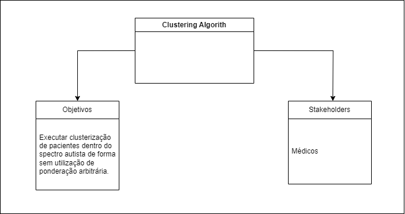

# DOCUMENTAÇÃO

## Indice

- [Sumário](#Sumário)
  - [Indice](#indice)
  - [Definição do problema problema](#definição-do-problema-problema)
  - [4C's](#4cs)
    - [1. Contexto (Context)](#1-contexto-context)
    - [2. Container (Contêiner)](#2-container-contêiner)
    - [3. Componente (Component)](#3-componente-component)
    - [4. Código (Code)](#4-código-code)
  - [Requisitos](#requisitos)
  - [Caso de Uso](#caso-de-uso)
    - [**Atores:**](#atores)
    - [**Casos de Uso:**](#casos-de-uso)
  - [Quadro Kambam](#quadro-kambam)

## Definição do problema problema

- Quem é o cliente?
    Como potenciais clientes deste projeto destacam se profissionais da área médica, psicologia, Terapia Ocupacional, Fonoaudiologia, dentre outras áreas onde são realizadas estudos relacionados a pacientes pertencentes ao espectro autista

- Quais os problemas ou oportunidades temos para resolver?
    Devido a falta de informações sistematizadas, os profissionais de área da saúde que cuidam de pacientes do TEA tem dificuldades de classificar seus pacientes incorrendo geralmente em ponderações arbitrárias para tal clusterização, o que é sabido ser algo plenamente impreciso. Pleiteiase criar um modelo de Machine Learning onde será utilizado o algoritmo não supervisionados chamado Custering . É fruto ainda deste trabalho criar, parametrizar, e executar este algoritmo na linguagem R.

- Qual o benefício claro que o cliente pode ter?
    É muito comum analisarmos observações dentro de um contexto (ou grupo) afim de identificarmos padrões de comportamentos dos registros observados. Na área médica, não é diferente. Hoje, médicos e demais profissionais da área da saúde agrupam pacientem com base em seu conhecimento e observações subjacentes, mas diante de dezenas (ou até centenas) de variáveis de uma paciente, é inevitável que ocorre ponderação arbitrária atribuindo valores de forma empírica (consequentemente não científica) na separação de pacientes em grupos afim de poder estudar estes pacientes sob a ótica do grupo onde está inserido. Espera se que com o resultado apresentado por este algoritmo, os profissionais da saúde tenham mais precisão ao analisar possíveis grupos de indivíduos visto que estes grupos (clusters) emergirão fruto deste poderoso algorítimo de Machine Learning, o Clustering

- Como será a experiência do cliente nesse novo serviço?

    Em um primeiro momento, como fruto deste trabalho, serão ofertados aos clientes da área de saúde uma relação de grupos com seus respectivos pacientes oriundos da clusterização do algoritmo de Clustering sem que haja quaisquer ponderações arbitrárias. O número de grupos poderá ser definido pelo cliente / restrição do problema de negócio ( k means method ), ou ser “sugerido” pelo método Hierarchical Cluster Analysis . O cliente participará desta decisão pois a escolha do método influenciará diretamente o resultado. Posteriormente, pode se avaliar a criação de uma interface a nível de usuário para coleta das informações de cada paciente, mas como fruto deste projeto sugiro foco na parte de DataScience (Machine Learning) sendo disponibilizado uma tela desenvolvida em Python onde o cliente escolherá o dataset bem como dará start no modelo.

## 4C's

### 1. Contexto (Context)

- **Nome:** ClusteringAlgorithm
- **Objetivo:** Executar clusterização de pacientes dentro do spectro autista de forma sem utilização de ponderação arbitrária.
- **Stakeholders:** Médicos

---

### 2. Container (Contêiner)

- **Nome:** Algorítimo Clustering
  - **Tecnologias:** Script Machine Learning: (R Language);

  - **Responsabilidade:** Executar o algorítimo Clustering.

---

### 3. Componente (Component)

- **Nome:** Módulo Seleção Dataset
  - **Responsabilidade:** Habilitar a seleção de dataset local.

- **Nome:** Módulo de Parametrizações
  - **Responsabilidade:** Permitir realizar as parametrizações do algorítimo.

- **Nome:** Módulo de Execução
  - **Responsabilidade:** Evocar o algorítimo.

- **Nome:** Módulo Exportar Resultados
  - **Responsabilidade:** Exportar o resultado para arquivos xlsx.

---

### 4. Código (lib)

- **Bibliotecas Utilizadas:**

  - R
    - library tidyverse
    - library (cluster) 
    - library dendextend
    - library factoextra
    - library fpc
    - library gridExtra
    - library readxl
    - library reshape
    - library dplyr

  - PYTHON
    - pandas
    - django

---

## Requisitos

- **Selecionar Dataset:**
  - Selecionar localmente arquivo de excel contendo dataset.

- **Selecionar Método de Cálculo:**
  - Selecionar método de cálculo, sendo as opções:Euclidean Distance , Minkowski distance , Chebychev distance, Canberra distance ou Manhattan distance..

  - **Selecionar Método de Encadeamento:**
  - Escolher qual o método de encadeamento do algorítimo, sendo as opções : Complete Linkage , Single Linkage Centroid Method.

  - **Selecionar Número de Clusters:**
  - Escolher número de clusters a ser utilizados pelo algorítimos k-means.

  - **Executar o Algorítimo:**
  - Executar o Algorítimo.

  - **Exportar Resultado:**
  - Exportar o Resultado em formato de planilha eletrônica xlsx.

## Caso de Uso

### **Atores:**

1. **Médicos:** Serão os únicos atores da aplicação.

---

### **Casos de Uso:**

1. **Selecionar Dataset:**
   - **Ator:** Médico
   - **Descrição:** O usuário poderá selecionar um dataset em format xlsx para executar o algorítimo de Clustering.

2. **Selecionar Método de Cálculo:**
   - **Ator:** Médico
   - **Descrição:** O usuário poderá selecionar o método de cálculo que o algorítimo utilizará

3. **Selecionar Método de Encadeamento:**
   - **Ator:** Médico
   - **Descrição:** O usuário poderá escolher qual o método de encadeamento.

4. **Selecionar Número de Clusters:**
   - **Ator:** Médico
   - **Descrição:** O usuário poderá escolher qual o número de clusters no K-Means.

5. **Executar o Algorítimo:**
   - **Ator:** Médico
   - **Descrição:** O usuário poderá executar o algorítimo de ML.

6. **Exportar o Resultado:**
   - **Ator:** Médico
   - **Descrição:** O usuário poderá explortar o resultado em formato excel.

## Quadro Kambam

[Clique aqui para acessar o quadro Kambam](https://trello.com/invite/b/b0mpq9dW/ATTIf8882b9b47b05f4b332b943e5945413dF9714CA7/portfolio)

